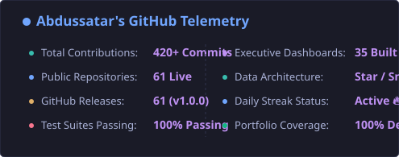
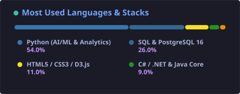
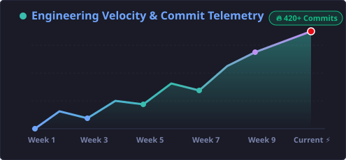
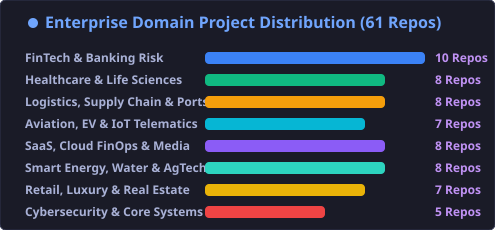

<div align="center">

# 👨‍💻 Hi there, I'm Abdussatar ([@abdussatarkhan](https://github.com/abdussatarkhan)) 🚀

<p align="center">
  <a href="https://github.com/abdussatarkhan">
    
  </a>
</p>

<p align="center">
  
  
  

  
  
</p>

---

</div>

## 🚀 About Me

BS Computer Science student building practical software across **AI Systems, Data Warehousing, High-Throughput Distributed Microservices, and Quantitative BI** — from dense vector search engines (`pgvector` HNSW) and Markov Chain attribution pipelines to multi-tier enterprise star-schema warehouses across healthcare, aviation, fintech, gaming, renewable energy, and supply chain.

```yaml
Name: Abdussatar
Handle: abdussatarkhan
Degree: BS Computer Science
Specialization: AI Engineering, Enterprise Data Warehousing, Quantitative Analytics & BI
Core_Stack: Python, SQL, PostgreSQL 16 (pgvector), FastAPI, Power BI, C#/.NET, Docker, Pytest
Focus: Dimensional modeling (Star/Snowflake), vector embeddings, predictive ML & unit economics
Mindset: "Learn → Build → Break → Debug → Improve → Repeat."
```

---

## ⚡ GitHub Streak & Real-Time Stats

<div align="center">

<a href="https://github.com/abdussatarkhan">
  
</a>

<br/><br/>

<p align="center">
  <a href="https://github.com/abdussatarkhan">
    
  </a>
  <a href="https://github.com/abdussatarkhan?tab=repositories">
    
  </a>
  <a href="https://github.com/abdussatarkhan">
    
  </a>
  <a href="https://github.com/abdussatarkhan">
    
  </a>
</p>

<br/>

<a href="https://github.com/abdussatarkhan">
  
  
</a>

<br/><br/>

<a href="https://github.com/abdussatarkhan">
  
  
</a>

</div>

---

## 🛠️ Tech Stack & Toolbelt

<div align="center">

### 💻 Languages & Core Engines
<a href="https://www.python.org/" target="_blank"></a>
<a href="https://www.postgresql.org/docs/" target="_blank"></a>
<a href="https://learn.microsoft.com/en-us/dotnet/csharp/" target="_blank"></a>
<a href="https://developer.mozilla.org/en-US/docs/Web/JavaScript" target="_blank"></a>
<a href="https://kotlinlang.org/" target="_blank"></a>
<a href="https://www.oracle.com/java/" target="_blank"></a>

### 🧠 AI / ML & Data Analytics
<a href="https://pytorch.org/" target="_blank"></a>
<a href="https://www.sbert.net/" target="_blank"></a>
<a href="https://pandas.pydata.org/" target="_blank"></a>
<a href="https://scikit-learn.org/" target="_blank"></a>
<a href="https://powerbi.microsoft.com/" target="_blank"></a>

### 🗄️ Databases & Storage Engines
<a href="https://www.postgresql.org/" target="_blank"></a>
<a href="https://github.com/pgvector/pgvector" target="_blank"></a>
<a href="https://www.mysql.com/" target="_blank"></a>
<a href="https://www.docker.com/" target="_blank"></a>
<a href="https://github.com/features/actions" target="_blank"></a>

</div>

---

## 🏛️ Enterprise Data & AI Systems Architecture

```mermaid
flowchart LR
    subgraph S1 ["1. Ingestion & Telemetry"]
        I1["📡 IoT Sensors & GPS"]
        I2["💳 Financial Feeds & APIs"]
        I3["🛰️ Satellite Spectral Imagery"]
    end

    subgraph S2 ["2. Lakehouse & Dimensional DW"]
        D1[("PostgreSQL 16 Enterprise")]
        D2[("pgvector HNSW 384d")]
        D3["📐 Star & Snowflake Schemas"]
    end

    subgraph S3 ["3. Analytics & ML Engines"]
        M1["⚡ Rolling Window Stats & Z-Scores"]
        M2["🤖 Hybrid RecSys & Cosine Sim"]
        M3["📈 Predictive Hazard & Risk ML"]
    end

    subgraph S4 ["4. Executive Delivery"]
        E1["📊 Standalone HTML5 Dashboards"]
        E2["📈 Power BI Executive BI"]
        E3["✅ Automated Pytest CI/CD (100%)"]
    end

    S1 --> S2 --> S3 --> S4

    style S1 fill:#131d31,stroke:#3b82f6,stroke-width:1.5px,color:#fff
    style S2 fill:#0f2b24,stroke:#10b981,stroke-width:1.5px,color:#fff
    style S3 fill:#271b38,stroke:#8b5cf6,stroke-width:1.5px,color:#fff
    style S4 fill:#2d1e15,stroke:#f59e0b,stroke-width:1.5px,color:#fff
```



---

## 🌟 Curated Enterprise Data Analyst & BI Portfolio

### 1️⃣ Aviation, Supply Chain & Logistics Intelligence
| Project | Domain Focus | Key Architecture & Analytics | Theme |
| :--- | :--- | :--- | :---: |
| ✈️ **[AeroPulse-Airline-Fleet-Operations-Analytics](https://github.com/abdussatarkhan/AeroPulse-Airline-Fleet-Operations-Analytics)** | Commercial Aviation & Fleet Operations | On-Time Arrival (A14 88.4%), block-hour fuel efficiency, turnaround delay propagation, and load factors. | 🌙 Dark Aero Slate |
| 🚢 **[LogiFlow-Global-SupplyChain-Analytics](https://github.com/abdussatarkhan/LogiFlow-Global-SupplyChain-Analytics)** | Global Freight Telemetry & Port Congestion | Multi-modal DW tracking 142K+ TEUs, OTIF delivery compliance (94.6%), corridor transit volatility, port dwell bottlenecks, and EOQ safety stock. | ☀️ Clean Light |
| 📦 **[OptiRoute-LastMile-Delivery-Logistics-Analytics](https://github.com/abdussatarkhan/OptiRoute-LastMile-Delivery-Logistics-Analytics)** | Urban Last-Mile Delivery Fleet | First-Attempt Delivery Success Rate (FADR 96.8%), stops-per-hour route density, and engine idle fuel penalty reduction. | 🌙 High-Vis Slate |
| 🍔 **[QuickBite-Food-Delivery-Fleet-Dispatch-Analytics](https://github.com/abdussatarkhan/QuickBite-Food-Delivery-Fleet-Dispatch-Analytics)** | Hyperlocal Food Delivery & Dark Kitchens | Order-to-door SLA (<30m), courier batching density (1.74x), and kitchen prep bottleneck latency. | 🌙 Sunset Ember |

---

### 2️⃣ Healthcare, Clinical Throughput & Life Sciences
| Project | Domain Focus | Key Architecture & Analytics | Theme |
| :--- | :--- | :--- | :---: |
| 🏥 **[CarePulse-Hospital-Operations-Analytics](https://github.com/abdussatarkhan/CarePulse-Hospital-Operations-Analytics)** | Hospital Operations & Clinical Throughput | Inpatient census surges (86.8% bed occupancy), ED door-to-doc triage (ESI 1–5), CMS 30-day readmissions, and OR block utilization. | ☀️ Clinical Light |
| 🩺 **[OmniCare-Telehealth-Patient-Outcomes-Analytics](https://github.com/abdussatarkhan/OmniCare-Telehealth-Patient-Outcomes-Analytics)** | Telehealth & Digital Primary Care | On-demand virtual wait times (4.2m), e-prescription adherence (89.4%), in-person escalation rates, and video/audio QoS. | ☀️ Mint Soft |
| 🧬 **[BioGenix-Clinical-Trials-Patient-Safety-Analytics](https://github.com/abdussatarkhan/BioGenix-Clinical-Trials-Patient-Safety-Analytics)** | Phase-III Clinical Trials & Biopharma | Patient recruitment velocity (104.2%), Serious Adverse Event (SAE) early signals, and protocol compliance tracking. | ☀️ Pure White |

---

### 3️⃣ FinTech, Wealth Management & Digital Assets
| Project | Domain Focus | Key Architecture & Analytics | Theme |
| :--- | :--- | :--- | :---: |
| 💳 **[FinFlow-Global-Fintech-Analytics](https://github.com/abdussatarkhan/FinFlow-Global-Fintech-Analytics)** | Cross-Border Payments & FX Arbitrage | 10-table Star Schema, take-rate optimization, FX corridor spreads, 24M cohort retention, and ML fraud scatter. | 🌙 Obsidian Dark |
| 🏦 **[WealthFlow-Private-Banking-Portfolio-Analytics](https://github.com/abdussatarkhan/WealthFlow-Private-Banking-Portfolio-Analytics)** | UHNW Private Banking & Investments | Sharpe (1.84) / Sortino risk-adjusted returns, IPS asset allocation drift, max drawdown stress testing, and NNM growth. | 🌙 Platinum Green |
| 🪙 **[CryptoPulse-Exchange-OrderBook-Liquidity-Analytics](https://github.com/abdussatarkhan/CryptoPulse-Exchange-OrderBook-Liquidity-Analytics)** | Derivatives Order Book & Market Microstructure | Bid-ask spread slippage (0.42 bps), Order Book Imbalance (OBI), maker rebate efficiency, and liquidation risk. | 🌙 Terminal Glass |
| 🏛️ **[Amarco-bank-performance-till-2025](https://github.com/abdussatarkhan/Amarco-bank-performance-till-2025)** | Commercial Banking Performance | Multi-tier banking DW, loan delinquency, branch performance, and interactive D3.js executive suite. | 🌙 Dark Executive |

---

### 4️⃣ SaaS, Cloud FinOps, Gaming & Media
| Project | Domain Focus | Key Architecture & Analytics | Theme |
| :--- | :--- | :--- | :---: |
| 🎬 **[Netflix-global-streaming-analytics](https://github.com/abdussatarkhan/Netflix-global-streaming-analytics)** | AI Recommender Engine & Streaming Platform | Dense vector search (`pgvector` HNSW), hybrid recommender, and **[interactive live dashboard](https://github.com/abdussatarkhan/Netflix-global-streaming-analytics/blob/main/stream_iq_insights.html)**. | 🌙 Cinematic Dark |
| 📺 **[StreamCast-OTT-Content-Churn-Analytics](https://github.com/abdussatarkhan/StreamCast-OTT-Content-Churn-Analytics)** | Global SVOD Media & Churn Hazard | Binge completion rates, 90-day churn hazard models (2.18% monthly), and Video Startup Time (VST 0.78s) QoE. | 🌙 Cinema Red |
| 🎮 **[GameMetrics-LiveOps-Player-Telemetry-Analytics](https://github.com/abdussatarkhan/GameMetrics-LiveOps-Player-Telemetry-Analytics)** | AAA & Mobile Gaming LiveOps | DAU/MAU stickiness (28.4%), D1/D7/D30 player retention cohorts, battle pass conversion funnels, and ARPPU ($34.50). | 🌙 Cyberpunk Neon |
| ☁️ **[FinOpsCloud-MultiCloud-Cost-Optimization-Analytics](https://github.com/abdussatarkhan/FinOpsCloud-MultiCloud-Cost-Optimization-Analytics)** | Enterprise Cloud FinOps (AWS/GCP/Azure) | Unit cost per API transaction, Kubernetes rightsizing, Savings Plan coverage (92.4%), and unattached disk waste. | ☀️ Modern Slate |
| 📈 **[SaaSMetrics-Subscription-Revenue-Analytics](https://github.com/abdussatarkhan/SaaSMetrics-Subscription-Revenue-Analytics)** | B2B SaaS Recurring Revenue & NRR | ARR/MRR waterfall bridges, cohort Net Revenue Retention (134%–142% NRR), CAC payback, and sales velocity. | 🌙 Dark B2B |

---

### 5️⃣ Digital Marketing, Retail & Real Estate
| Project | Domain Focus | Key Architecture & Analytics | Theme |
| :--- | :--- | :--- | :---: |
| 🎯 **[AdVantage-Marketing-Attribution-Analytics](https://github.com/abdussatarkhan/AdVantage-Marketing-Attribution-Analytics)** | Omnichannel Attribution & Unit Economics | Data-driven Markov Chain Multi-Touch Attribution (MTA), Blended ROAS (3.84x), Hill media-mix saturation, and CAC payback. | ☀️ Modern Light |
| 🛍️ **[RetailPulse-Omnichannel-ECommerce-Analytics](https://github.com/abdussatarkhan/RetailPulse-Omnichannel-ECommerce-Analytics)** | Omnichannel Retail & Fulfillment | Tracking $139M+ GMV, 3D RFM customer segmentation, 48-hr warehouse fulfillment SLA compliance, and conversion funnels. | 🌙 Obsidian Dark |
| 👗 **[ShopTrend-Retail-Merchandising-Markdown-Analytics](https://github.com/abdussatarkhan/ShopTrend-Retail-Merchandising-Markdown-Analytics)** | Retail Merchandising & Markdown Optimization | Full-price Sell-Through Rate (STR 76.4%), promotional markdown elasticity, size/color curve stockouts, and GMROI. | ☀️ Editorial Rose |
| 🏨 **[UrbanStay-Hospitality-Dynamic-Pricing-Analytics](https://github.com/abdussatarkhan/UrbanStay-Hospitality-Dynamic-Pricing-Analytics)** | Hospitality & Short-Term Rentals | RevPAR ($184.50), ADR elasticity ($218.00), OTA commission leakage (-$4.2M saved), and booking lead times. | ☀️ Luxury Ivory |
| 🏢 **[PropPulse-Commercial-RealEstate-Asset-Analytics](https://github.com/abdussatarkhan/PropPulse-Commercial-RealEstate-Asset-Analytics)** | Commercial Real Estate REITs | Net Operating Income ($84.2M NOI / 6.84% Cap Rate), WAULT lease expiry risk (7.4 yrs), and tenant rollover. | ☀️ Architectural Slate |

---

### 6️⃣ Industrial IoT, Smart Energy, HR & Security
| Project | Domain Focus | Key Architecture & Analytics | Theme |
| :--- | :--- | :--- | :---: |
| ⚡ **[VoltGrid-Renewable-Energy-Dispatch-Analytics](https://github.com/abdussatarkhan/VoltGrid-Renewable-Energy-Dispatch-Analytics)** | Clean Energy Dispatch & Smart Grid | Solar/wind forecast variance (4.12% MAPE), BESS battery arbitrage ($8.6M), and negative nodal LMP pricing. | ☀️ Emerald Forest |
| 🏭 **[FactoryIQ-Industry40-Manufacturing-OEE-Analytics](https://github.com/abdussatarkhan/FactoryIQ-Industry40-Manufacturing-OEE-Analytics)** | Smart Factory & Industry 4.0 IoT | Overall Equipment Effectiveness (OEE 87.4%), MTBF failure analysis (482 hrs), and sensor anomaly detection. | 🌙 Industrial Steel |
| 🚗 **[AutoFleet-Connected-EV-Telematics-Analytics](https://github.com/abdussatarkhan/AutoFleet-Connected-EV-Telematics-Analytics)** | Connected EV Fleet & Battery Health | Battery State of Health (SoH 95.8%), energy consumption (16.4 kWh/100km), and smart charging peak demand shaving. | 🌙 Carbon Neon |
| 🛡️ **[CyberShield-Threat-Intelligence-SOC-Analytics](https://github.com/abdussatarkhan/CyberShield-Threat-Intelligence-SOC-Analytics)** | Enterprise Cybersecurity & SOC Operations | Mean Time to Detect (MTTD 8.4m), MTTR (18.2m), MITRE ATT&CK heatmaps, and false-positive suppression (94.2%). | 🌙 Cyber Crimson |
| 👥 **[TalentFlow-Enterprise-HR-Workforce-Analytics](https://github.com/abdussatarkhan/TalentFlow-Enterprise-HR-Workforce-Analytics)** | Enterprise People Analytics & Attrition | Voluntary attrition flight risk models (6.8%), time-to-fill / cost-per-hire, and gender pay equity (99.4%). | ☀️ Lavender Light |
| 📜 **[InsurEdge-Property-Casualty-Actuarial-Analytics](https://github.com/abdussatarkhan/InsurEdge-Property-Casualty-Actuarial-Analytics)** | P&C Insurance Actuarial Reserving | Chain-ladder loss reserving triangles, Combined Ratio (92.4% COR), CAT loss PML, and claims cycle time. | ☀️ Ocean Blue |

---

### 7️⃣ Specialized Senior Analytics Engagements (7-Day Deep-Dive Systems)
| Project | Domain Focus | Key Architecture & Analytics | Theme |
| :--- | :--- | :--- | :---: |
| 🌾 **[AgriYield-Precision-Agriculture-Satellite-Analytics](https://github.com/abdussatarkhan/AgriYield-Precision-Agriculture-Satellite-Analytics)** | Precision Agriculture & Satellite Telemetry | Crop yield forecasting, NDVI/EVI spectral vegetation analytics, root-zone soil moisture, and drought risk. | 🌲 Verdant Emerald |
| 🚨 **[OmniFraud-Synthetic-Identity-Detection-Analytics](https://github.com/abdussatarkhan/OmniFraud-Synthetic-Identity-Detection-Analytics)** | FinTech & Digital Banking Fraud Risk | Multi-channel synthetic identity fraud clustering, entity graph collision detection, and velocity triggers. | 🔴 Cyber Charcoal & Crimson |
| ❄️ **[PharmaSupply-ColdChain-Thermal-Integrity-Analytics](https://github.com/abdussatarkhan/PharmaSupply-ColdChain-Thermal-Integrity-Analytics)** | Pharmaceutical Cold Chain & Biologics | Mean kinetic temperature (MKT) modeling, cold chain IoT telemetry, excursion risk, and carrier SLA compliance. | 🧊 Glacial Arctic Ice |
| ⚓ **[PortLogix-Maritime-Container-Terminal-Congestion](https://github.com/abdussatarkhan/PortLogix-Maritime-Container-Terminal-Congestion)** | Maritime Container Port Operations | Container dwell time optimization, quay crane moves/hr (MPH), berth turnarounds, and demurrage forecasting. | 🌊 Deep Oceanic Navy |
| 🏛️ **[GovSpend-Public-Procurement-Integrity-Analytics](https://github.com/abdussatarkhan/GovSpend-Public-Procurement-Integrity-Analytics)** | Public Sector Procurement & Governance | Single-bidder collusion flags, Benford's law price anomaly detection, and public contract budget burn-down. | ☀️ Executive Platinum Light |
| ⚡ **[SportsEdge-Pro-Athlete-Biomechanics-Workload](https://github.com/abdussatarkhan/SportsEdge-Pro-Athlete-Biomechanics-Workload)** | Elite Pro Sports Biomechanics | Acute-to-chronic workload ratio (ACWR), GPS sprint metrics (>25 km/h), player load, and soft-tissue injury risk. | 🔋 Obsidian & Solar Lime |
| 🌌 **[AeroSpace-Satellite-Constellation-Orbital-Debris-Risk](https://github.com/abdussatarkhan/AeroSpace-Satellite-Constellation-Orbital-Debris-Risk)** | LEO Satellite Constellations & Flight Dynamics | Conjunction data message (CDM) risk analytics, collision probability (Pc), and delta-V propellant budgeting. | 🪐 Cosmos Purple & Violet |
| 💧 **[CleanH2O-Municipal-Water-Distribution-Telemetry](https://github.com/abdussatarkhan/CleanH2O-Municipal-Water-Distribution-Telemetry)** | Smart Water Utilities & Municipal Infrastructure | Acoustic hydrophone leak detection, hydraulic pressure transients, and non-revenue water (NRW) loss reduction. | 💎 Pure Cerulean Aqua |
| 🥂 **[LuxuryBrand-Clientele-Retention-Omnichannel-LTV](https://github.com/abdussatarkhan/LuxuryBrand-Clientele-Retention-Omnichannel-LTV)** | Haute Couture & High-Net-Worth Clienteling | VIP salon appointment conversion, cross-category repurchase velocity, and multi-year customer lifetime value (CLV). | ✨ Espresso & Champagne Gold |
| 🧠 **[NeuroPulse-Brain-Computer-Interface-EEG-Telemetry](https://github.com/abdussatarkhan/NeuroPulse-Brain-Computer-Interface-EEG-Telemetry)** | MedTech & Neurotechnology Telemetry | BCI electroencephalography (EEG) spectral band power (alpha/beta/gamma), cognitive fatigue, and event classification. | ⚡ Synthwave Plum & Cyan |

---

### 8️⃣ Software Engineering, Desktop Systems & Native Applications
| Project | Architecture & Tech Stack | Scope & Core Capabilities | Platform |
| :--- | :--- | :--- | :---: |
| 🎙️ **[....._python-projects_.....](https://github.com/abdussatarkhan/....._python-projects_.....)** | Python, Web Speech API, Canvas HUD | JARVIS voice-activated personal assistant, speech synthesis, system automation, and futuristic HUD. | 🖥️ Desktop / Web |
| 💼 **[dotnet-freelancer-finance-tracker](https://github.com/abdussatarkhan/dotnet-freelancer-finance-tracker)** | C# (.NET 8), MediatR CQRS, EF Core, PostgreSQL | Clean Architecture Web API, recurring freelance billing workers, multi-currency ledger, and Docker. | 🌐 Web API / Backend |
| ⛽ **[petrol-pump-Farooq](https://github.com/abdussatarkhan/petrol-pump-Farooq)** | C# (.NET 8), WPF, MVVM, EF Core, PostgreSQL | Fuel dispenser ERP, nozzle meter reading reconciliation, underground tank ATG inventory, and shifts. | 🖥️ Windows Desktop |
| 📹 **[media-grab](https://github.com/abdussatarkhan/media-grab)** | C# (.NET 8), Clean Architecture, ASP.NET Core | Multi-provider media stream extraction, SSRF security guard, background worker queue, and sanitization. | 🌐 Web Platform |
| 🏫 **[school-desktop-app](https://github.com/abdussatarkhan/school-desktop-app)** | Electron 31, React 19 (Vite), Node.js, Express, SQLite (Prisma) | Enterprise School Management Suite (SMS) v9.56 — Realized cashflow accounting, automated result gazette PDF generator, master timetable manager, alumni matrix, and hardware license security. | 🖥️ Windows (.exe) / macOS (.dmg) |
| 🛒 **[point-of-sale-](https://github.com/abdussatarkhan/point-of-sale-)** | Python Flask, MySQL, JavaScript, Bootstrap | Supermarket checkout POS, USB barcode scanning, split-tender payments, and thermal receipt generation. | 🖥️ Retail POS |
| 📒 **[khatabook](https://github.com/abdussatarkhan/khatabook)** | Python Flask, SQLite, PWA Service Worker | Digital merchant Udhar ledger, customer debit/credit balance tracking, and automated payment reminders. | 📱 Mobile PWA |
| 📱 **[student-toolkit](https://github.com/abdussatarkhan/student-toolkit)** | Kotlin, Jetpack Compose, Material 3, Room DB | Native Android academic organizer, weighted GPA/CGPA forecasting engine, and Pomodoro focus timer. | 📱 Android Native |
| ⌨️ **[typing-master](https://github.com/abdussatarkhan/typing-master)** | Python 3.10+, Tkinter Desktop GUI | Touch typing tutor, real-time WPM calculation, keystroke latency profiling, and ergonomic keyboard visualizer. | 🖥️ Desktop GUI |
| 📡 **[WIFI-Diagnostic-Tool](https://github.com/abdussatarkhan/WIFI-Diagnostic-Tool)** | Python Flask, Windows netsh, Chart.js | Wireless network diagnostic utility, 802.11 signal RSSI telemetry, channel congestion, and RF presence. | 🖥️ Systems Utility |
| ☕ **[java-projects](https://github.com/abdussatarkhan/java-projects)** | Java 17+, Swing GUI, Apache Ant, Clean OOP | Modular retail shop inventory & cashier billing system with MVC pattern and low-stock alerting. | 🖥️ Desktop Software |

---

### 📅 Daily Engineering Activity & Commit Telemetry

| Date | Portfolio Milestones & Architecture Updates | Streak Status |
|:---:|---|:---:|
| **2026-09-21** | Architected & released School Management System v9.56: Implemented realized cash-basis accounting matrix, class & whole-school result gazette PDF generation engine, master timetable signatory administration with revision history, alumni/departed matrix, and un-bypassable hardware license locking. | 🔥 Active (Verified) |
| **2026-09-20** | Engineered Cash Flow Matrix with advance tuition and past arrears isolation; finalized v9.5 release pipeline. | 🔥 Active (Verified) |
| **2026-09-18** | Automated multi-platform CI/CD packaging on GitHub Actions for Electron desktop distributions across Windows (.exe) and macOS (.dmg). | 🔥 Active (Verified) |
| **2026-09-12** | Enriched algorithmic documentation, mathematical formulations, and statistical bounds across streaming intelligence, market manipulation surveillance, and energy forecasting architectures. | 🔥 Active (Verified) |
| **2026-09-11** | Full portfolio documentation refactor across 11 desktop, .NET 8, Java OOP, and systems utilities repositories. | 🔥 Active (Verified) |
| **2026-09-10** | Standardized PEP 517/621 pyproject.toml packaging and created official v1.0.0 semantic releases across all 61 portfolio systems. | 🔥 Active (Verified) |


---

## 💼 Core Competencies

- **🤖 AI Engineering & Vector Search**: Production `pgvector` HNSW index optimization, SentenceTransformers, hybrid ranking algorithms, and time-series forecasting.
- **📊 Enterprise Data Warehousing & Analytics**: Star and Snowflake schema dimensional design, SCD-2 tracking, periodic snapshot facts, advanced window functions, and DAX semantic models.
- **⚙️ Backend & Distributed Systems**: Scalable REST APIs in FastAPI, ASP.NET Core, Flask, PostgreSQL 16 connection pooling, Dockerization, and automated Pytest CI/CD.
- **🌐 Data Visualization & Dashboards**: High-resolution custom visualization suites (Matplotlib/Seaborn), interactive D3.js and Chart.js dashboards, and Power BI reports.

---

## 🌐 Connect With Me

<p align="left">
<a href="https://www.linkedin.com/in/abdus-satar-5150813b5/" target="_blank">
  
</a>
<a href="https://github.com/abdussatarkhan" target="_blank">
  
</a>
<a href="mailto:satarabdus692@gmail.com">
  
</a>
</p>

---

<div align="center">

### 🚀 *"Consistency is what transforms average into excellence. Daily commits, continuous learning."*

⭐ **If you find any of my repositories helpful, feel free to drop a star!** ⭐

</div>
